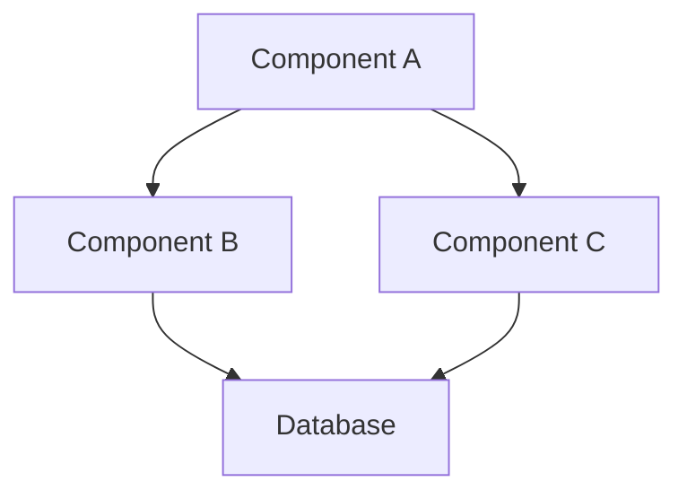
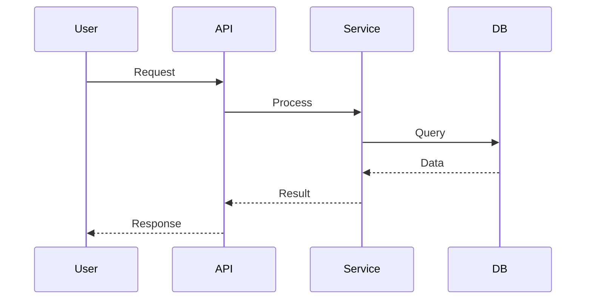
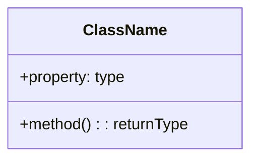

# Code Documentation Generator

Automatically generates or updates README.md files for code projects with comprehensive documentation including architecture diagrams, feature explanations, and code flow visualizations.

## Core Workflow

### 1. Project Analysis

**Scan project structure:**
- Identify project type (Node.js, Python, Java, Go, etc.)
- List all source files and directories
- Detect configuration files (package.json, requirements.txt, pom.xml, go.mod, etc.)
- Identify entry points (main files, index files, etc.)

**Analyze code architecture:**
- Parse import/require statements to understand dependencies
- Identify main components, modules, and their relationships
- Detect design patterns and architectural styles
- Map data flow between components

### 2. Generate Documentation Structure

Create or update README.md with these sections:

```markdown
# Project Title

## Overview
Brief description of what the project does

## Architecture
Mermaid diagram showing system architecture

## Features
List of main features with explanations

## Code Structure
Directory structure with explanations

## Key Components
Detailed explanation of main components

## Data Flow
Mermaid sequence diagram showing data flow

## Getting Started
Installation and setup instructions

## Usage
How to use the project with examples

## API Documentation (if applicable)
API endpoints or public interfaces

## Dependencies
List of dependencies with purpose

## Contributing
Contribution guidelines (if needed)
```

### 3. Generate Mermaid Diagrams

**Architecture Diagram:**


**Sequence Diagram:**


**Class Diagram (for OOP projects):**


See `references/mermaid-syntax.md` for complete Mermaid diagram syntax and examples.

### 4. Update Existing README

When README.md already exists:

1. **Preserve existing content**: Don't remove user-written content
2. **Update specific sections**: Replace or enhance outdated sections
3. **Add missing sections**: Add new sections that don't exist
4. **Maintain structure**: Keep the existing organization unless it's clearly problematic
5. **Mark AI-generated sections**: Optionally add comments to indicate AI-generated content

**Update strategy:**
- If user specifies a feature to document: Focus on that feature only
- If user wants architecture update: Replace architecture section and diagrams
- If user wants full update: Regenerate all technical sections while preserving introduction

### 5. Language-Specific Analysis

**JavaScript/TypeScript:**
- Analyze package.json for scripts and dependencies
- Detect framework (React, Next.js, Express, etc.)
- Identify build tools (Webpack, Vite, etc.)
- Parse JSDoc comments

**Python:**
- Analyze requirements.txt or pyproject.toml
- Detect framework (Django, Flask, FastAPI, etc.)
- Parse docstrings
- Identify virtual environment setup

**Java:**
- Analyze pom.xml or build.gradle
- Detect framework (Spring Boot, etc.)
- Parse JavaDoc comments
- Identify Maven/Gradle configuration

**Go:**
- Analyze go.mod
- Identify main packages
- Parse Go doc comments
- Detect standard project layout

See `references/language-patterns.md` for language-specific analysis patterns and common project structures.

### 6. Best Practices

**Documentation quality:**
- Use clear, concise language
- Provide concrete examples
- Include code snippets where helpful
- Explain "why" not just "what"
- Keep diagrams simple and focused

**Diagram design:**
- Use appropriate diagram types for the content
- Keep diagrams readable (not too many nodes)
- Use consistent naming conventions
- Add clear labels and descriptions
- Focus on high-level architecture, not implementation details

**README organization:**
- Start with overview for quick understanding
- Progressive detail: high-level first, then specific
- Include quick start guide prominently
- Make it scannable with clear headings
- Keep it maintainable (avoid excessive detail that becomes outdated)

See `references/readme-templates.md` for README template examples.

## Usage Examples

**Generate new documentation:**
```
"Generate comprehensive documentation for this project with architecture diagrams"
```

**Update specific feature:**
```
"Update the README to document the new authentication feature"
```

**Add architecture diagram:**
```
"Add an architecture diagram to the README showing how the components interact"
```

**Update existing section:**
```
"Update the API documentation section with the latest endpoints"
```

## DeepWiki Integration

For complex or unfamiliar projects, use DeepWiki to quickly understand the codebase:

```
https://deepwiki.com/{owner}/{repo}
```

DeepWiki provides:
- AI-generated documentation and explanations
- Architecture diagrams and code flow analysis
- Component relationship mapping
- Quick project overview

Use DeepWiki insights to enhance your documentation generation.

## Reference Materials

- `references/mermaid-syntax.md` - Complete Mermaid diagram syntax and examples
- `references/language-patterns.md` - Language-specific analysis patterns and common project structures
- `references/readme-templates.md` - README template examples for different project types

