# Mermaid 图表语法参考

## 流程图 (Flowchart)

### 基本语法

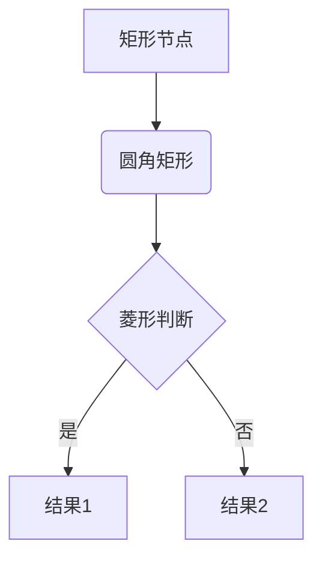

### 方向

- `TB` / `TD` - 从上到下
- `BT` - 从下到上
- `LR` - 从左到右
- `RL` - 从右到左

### 节点形状

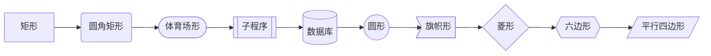

### 连接线样式

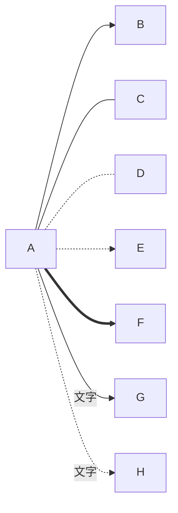

## 时序图 (Sequence Diagram)

### 基本语法

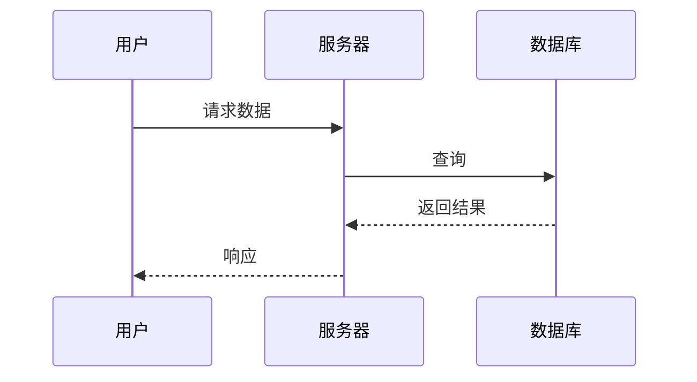

### 消息类型

- `->` 实线无箭头
- `-->` 虚线无箭头
- `->>` 实线有箭头
- `-->>` 虚线有箭头
- `-x` 实线带 x
- `--x` 虚线带 x

### 激活框

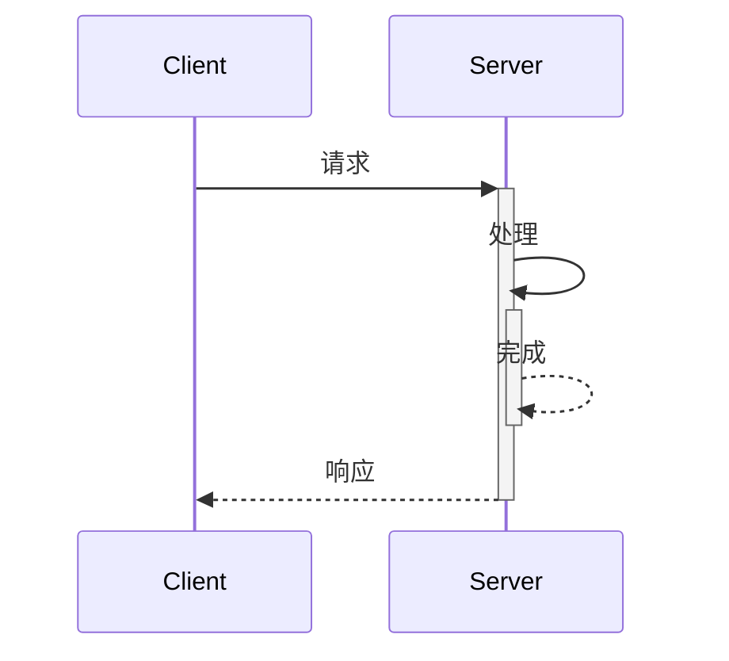

## 类图 (Class Diagram)

### 基本语法

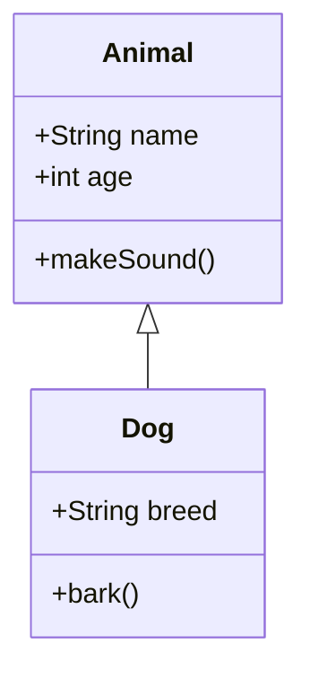

### 关系类型

- `<|--` 继承
- `*--` 组合
- `o--` 聚合
- `-->` 关联
- `--` 链接
- `..>` 依赖
- `..|>` 实现

### 可见性

- `+` Public
- `-` Private
- `#` Protected
- `~` Package/Internal

## 状态图 (State Diagram)

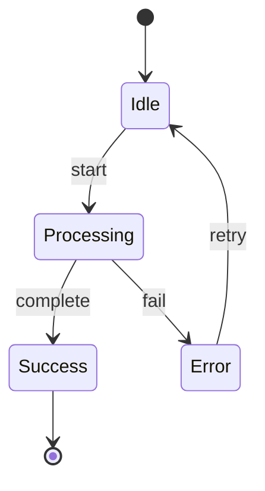

## 实体关系图 (ER Diagram)

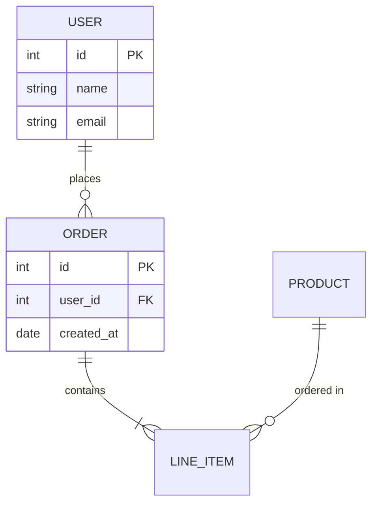

## 饼图 (Pie Chart)

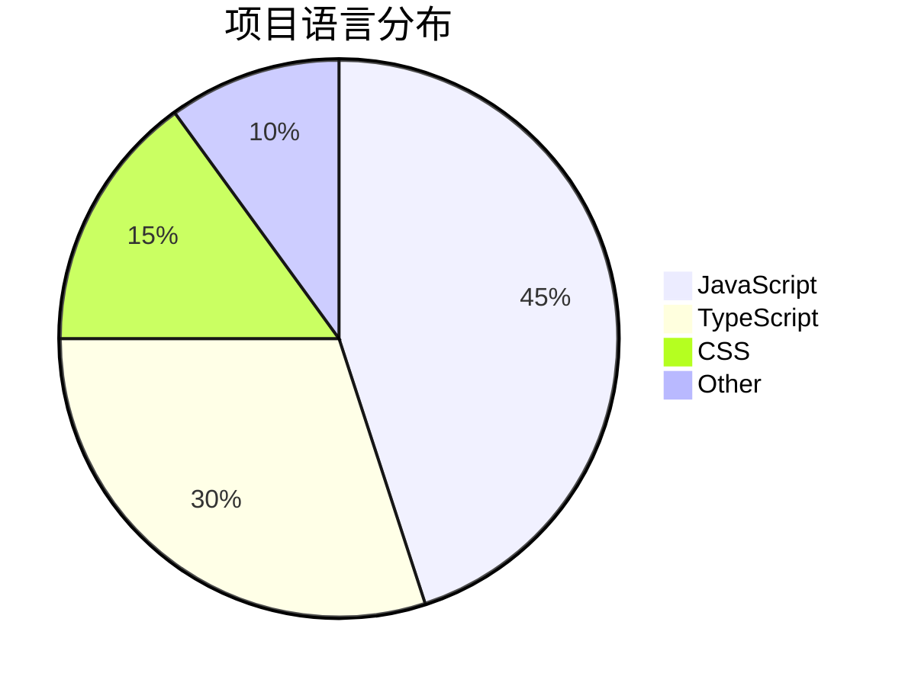

## 架构图示例

### Web 应用架构

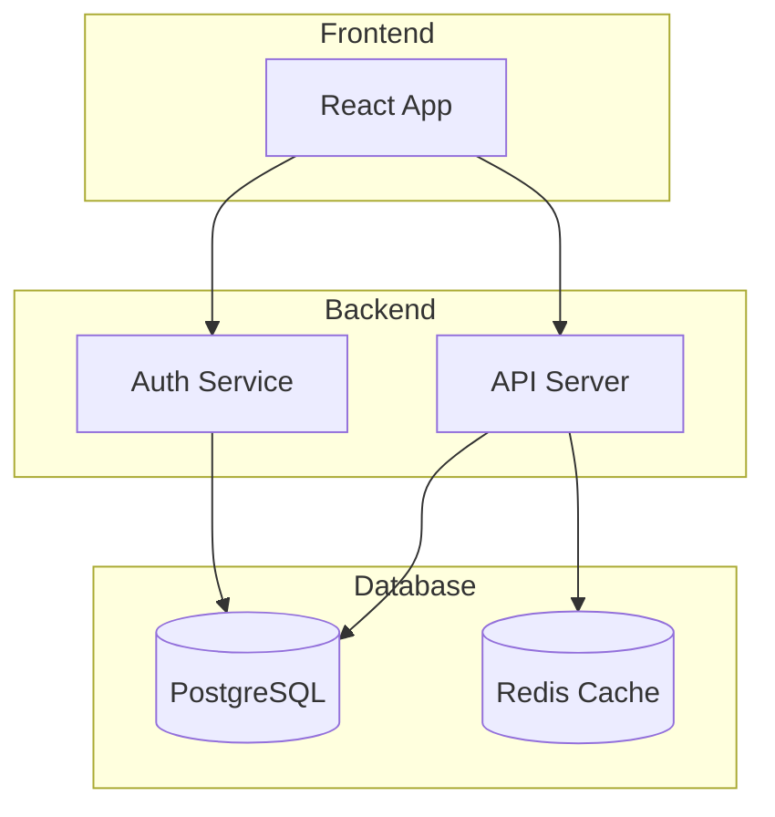

### 微服务架构

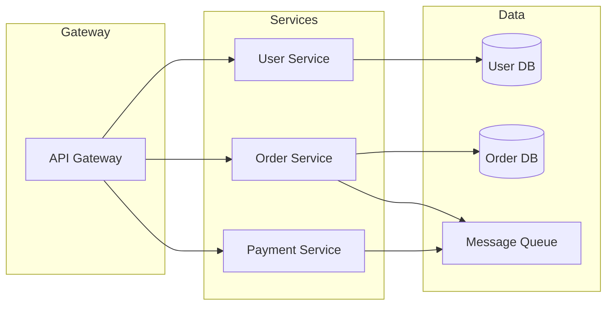

