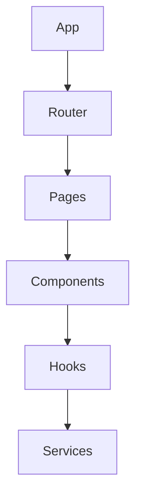
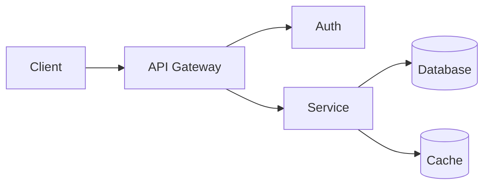

# README 模板示例

## 基础模板

```markdown
# 项目名称

简短描述项目的用途和目标。

## 功能特性

- 功能 1
- 功能 2
- 功能 3

## 快速开始

### 安装

```bash
npm install package-name
```

### 使用

```javascript
import { feature } from 'package-name';
```

## 文档

详细文档请参阅 [文档链接]。

## 许可证

MIT
```

## 前端项目模板

```markdown
# 项目名称

## 概述

项目简介和主要功能。

## 技术栈

- React 18
- TypeScript
- Vite
- TailwindCSS

## 架构



## 目录结构

```
src/
├── components/    # 可复用组件
├── pages/         # 页面组件
├── hooks/         # 自定义 Hooks
├── services/      # API 服务
└── utils/         # 工具函数
```

## 开发

```bash
# 安装依赖
npm install

# 启动开发服务器
npm run dev

# 构建生产版本
npm run build
```
```

## 后端 API 项目模板

```markdown
# API 服务名称

RESTful API 服务描述。

## 架构



## API 端点

| 方法 | 路径 | 描述 |
|------|------|------|
| GET | /api/users | 获取用户列表 |
| POST | /api/users | 创建用户 |
| GET | /api/users/:id | 获取用户详情 |

## 环境变量

| 变量 | 描述 | 默认值 |
|------|------|--------|
| PORT | 服务端口 | 3000 |
| DATABASE_URL | 数据库连接 | - |

## 运行

```bash
# 开发模式
npm run dev

# 生产模式
npm start
```
```

## CLI 工具模板

```markdown
# CLI 工具名称

命令行工具描述。

## 安装

```bash
npm install -g cli-name
```

## 使用

```bash
# 基本用法
cli-name <command> [options]

# 示例
cli-name init --name my-project
cli-name build --output dist
```

## 命令

| 命令 | 描述 |
|------|------|
| init | 初始化项目 |
| build | 构建项目 |
| dev | 启动开发模式 |

## 配置

在项目根目录创建 `.clirc` 文件：

```json
{
  "output": "dist",
  "minify": true
}
```
```

## npm 库模板

```markdown
# 库名称

库的简短描述。

## 安装

```bash
npm install library-name
```

## 使用

```javascript
import { feature } from 'library-name';

const result = feature(options);
```

## API

### `feature(options)`

功能描述。

**参数:**
- `options.param1` (string): 参数描述
- `options.param2` (number): 参数描述

**返回值:** 返回值描述

## 示例

```javascript
// 示例代码
```
```

